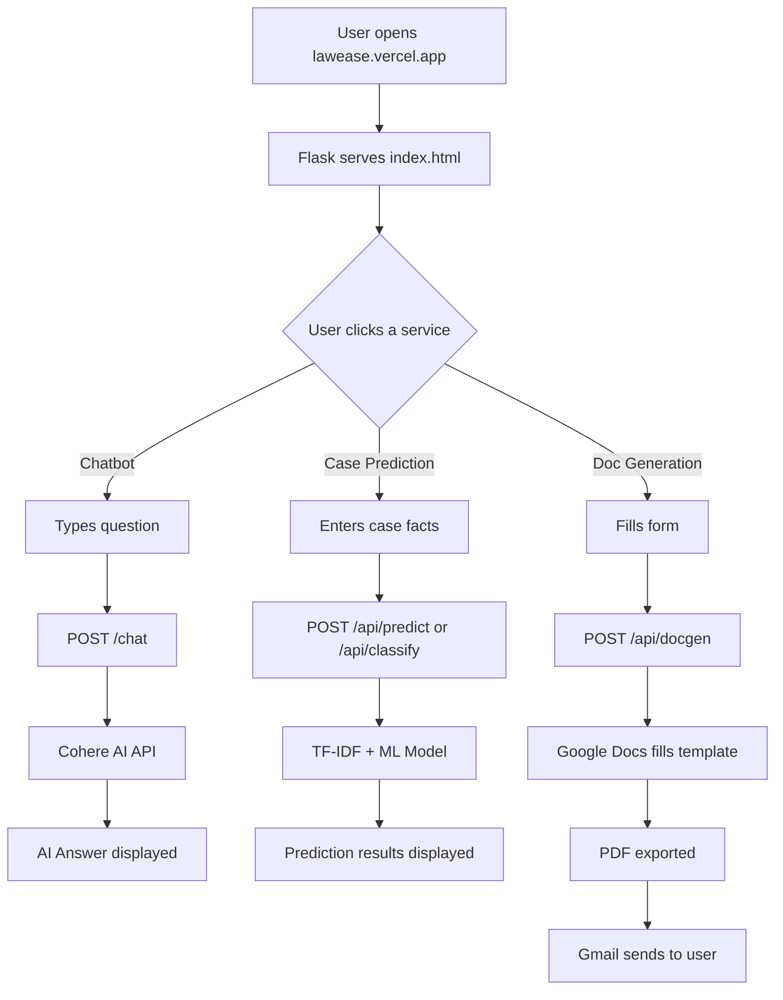

# 🏛️ LawEase — Project Presentation Guide

> **One-liner:** LawEase is an AI-powered legal assistant platform that can predict case outcomes, classify legal cases, auto-generate legal documents, and answer legal questions via chatbot — all from a single beautiful website.

---

## 🧱 Tech Stack (What Tools We Used)

| Layer | Technology | Why We Used It |
|---|---|---|
| **Backend (Brain)** | Python + Flask | Flask is a lightweight web framework. Think of it as the waiter in a restaurant — it takes requests from the user's browser and sends back the right response. |
| **AI Chatbot** | Cohere API (`command-r-plus`) | Cohere is an AI company (like OpenAI). We use their language model to answer legal questions in natural language. It's like having a mini lawyer inside the app. |
| **Case Prediction ML** | Scikit-learn (Logistic Regression + TF-IDF) | We trained a machine learning model on **real US Supreme Court data** ([justice.csv](file:///home/gin/Pictures/COMETButFree/majorPorject/lawease/Layer/justice.csv)) to predict which party is more likely to win a case. TF-IDF converts words into numbers so the model can understand text. |
| **Case Classification ML** | Scikit-learn (pre-trained [.pkl](file:///home/gin/Pictures/COMETButFree/majorPorject/lawease/Layer/tfidf_vectorizer.pkl) model) | Another ML model that reads the facts of a case and tells you what **category** it falls under — Criminal Law, Family Law, Cyber Law, etc. |
| **Document Generation** | Google Docs API + Google Sheets API | We have pre-made legal document templates on Google Docs (NDA, Partnership, IP Agreement). The app fills in the user's details, exports it as a PDF, and emails it. |
| **Email Delivery** | Gmail SMTP (smtplib) | Standard Python email library. Once the PDF is ready, it gets emailed to the user automatically. |
| **Frontend (Face)** | HTML + CSS + JavaScript | The website the user sees and interacts with. |
| **3D Visuals** | Three.js (WebGL) | Creates the beautiful floating particle constellation effect in the background. Makes the site look premium. |
| **Animations** | GSAP (GreenSock) | Handles all the smooth scroll animations, text reveals, fade-ins, and the loading screen. |
| **Hosting** | Vercel (Serverless) | The app is deployed online at `lawease.vercel.app`. Vercel runs our Python backend as serverless functions. |
| **Version Control** | Git + GitHub | All code is tracked and stored on GitHub for collaboration and deployment. |

---

## 🧠 How Each Feature Works (ELI5)

### 1. 🤖 AI Legal Chatbot

```
User types a question → Browser sends it to /chat → Flask sends it to Cohere AI → AI thinks → Answer comes back → Shown in chat bubble
```

**Simple explanation:**
> Imagine you have a really smart friend who has read every law book. You text them a question, they think for a second, and reply. That's exactly what our chatbot does — except the "friend" is Cohere's AI model running in the cloud.

**Technical flow:**
1. User types: *"What are my rights if my landlord won't return my deposit?"*
2. JavaScript sends this to our Flask server (`POST /chat`)
3. Flask forwards it to **Cohere's API** with a system prompt: *"You are a legal assistant..."*
4. Cohere's `command-r-plus` model generates a response
5. Flask sends the AI's answer back to the browser
6. JavaScript displays it in the chat widget

---

### 2. ⚖️ Case Outcome Prediction

```
User enters party names + case facts → Browser sends to /api/predict → TF-IDF converts text to numbers → Logistic Regression predicts probabilities → Animated bar chart shown
```

**Simple explanation:**
> Imagine you've watched 1000 court cases. After a while, you start noticing patterns — *"Oh, when the facts look like THIS, the petitioner usually wins."* That's what our ML model does. It was trained on thousands of real Supreme Court cases ([justice.csv](file:///home/gin/Pictures/COMETButFree/majorPorject/lawease/Layer/justice.csv)), and now it can look at new case facts and say: *"Petitioner has 72% chance of winning."*

**Technical flow:**
1. User enters: Petitioner name, Respondent name, and Case Facts
2. JavaScript sends this to `POST /api/predict`
3. The text is combined: `"Petitioner + Respondent + Facts"` → one big string
4. **TF-IDF Vectorizer** converts this string into a vector of 2000 numbers (word importance scores)
5. **Logistic Regression model** takes those numbers and outputs probabilities: `[0.72, 0.28]`
6. Result: *"Petitioner: 72%, Respondent: 28%"*  — shown with animated probability bars

**What is TF-IDF?**
> TF-IDF = Term Frequency × Inverse Document Frequency. It measures how important a word is. Common words like "the" get low scores. Rare legal terms like "habeas corpus" get high scores. This is how text becomes numbers for the ML model.

**What is Logistic Regression?**
> It's a classification algorithm. Given numbers (from TF-IDF), it draws a mathematical boundary and says: "This side = petitioner wins, that side = respondent wins." It also gives you a confidence percentage.

---

### 3. 🏛️ Case Classification

```
User describes their case → Browser sends to /api/classify → TF-IDF vectorizer → Pre-trained classifier → Returns category + description + documents needed + Indian Kanoon link
```

**Simple explanation:**
> You walk into a hospital and describe your symptoms. The doctor says: *"That's a skin problem, here's what you need to do."* Our classifier does the same for law. You describe your case, and it says: *"This is Family Law. Here are the documents you need and next steps."*

**Technical flow:**
1. User enters case description
2. **TF-IDF Vectorizer** ([tfidf_vectorizer.pkl](file:///home/gin/Pictures/COMETButFree/majorPorject/lawease/Layer/tfidf_vectorizer.pkl)) converts text → numbers
3. **Classification Model** ([case_category_model.pkl](file:///home/gin/Pictures/COMETButFree/majorPorject/lawease/Layer/case_category_model.pkl)) predicts the legal category
4. App looks up the category in [Book1.csv](file:///home/gin/Pictures/COMETButFree/majorPorject/lawease/Layer/Book1.csv) to get:
   - Description of that law category
   - Required documents
   - Recommended next steps
5. Also provides a direct link to **Indian Kanoon** (India's legal database) to read similar cases

---

### 4. 📄 Document Generation & Email

```
User fills form (NDA/Partnership/IP) → Browser sends to /api/docgen → Google Docs API fills template → Exports as PDF → Gmail SMTP emails it to user
```

**Simple explanation:**
> Imagine you have a fill-in-the-blank legal contract printed on paper. Instead of writing by hand, you type your details into a form, and a robot fills in all the blanks, prints it as a perfect PDF, and mails it to your inbox. That's exactly what this feature does — using Google Docs as the "paper" and Gmail as the "postman."

**Technical flow:**
1. User selects document type (Partnership / NDA / IP Agreement)
2. Fills in the form fields (names, addresses, dates, capital amounts, etc.)
3. JavaScript sends the data to `POST /api/docgen`
4. Flask does three things:
   - **Google Sheets API**: Saves a backup of the form data to a spreadsheet (record keeping)
   - **Google Docs API**: Copies the pre-made template, replaces all `{{placeholder}}` tags with user data, exports as PDF
   - **Gmail SMTP**: Emails the generated PDF to the user's email address
5. User gets a professional legal PDF in their inbox within seconds

---

## 🗂️ Project Structure (Simplified)

```
lawease/
├── app.py                  ← 🧠 The Brain (all Flask routes + ML models)
├── config.py               ← ⚙️ Google Docs template IDs + email config
├── requirements.txt        ← 📦 List of Python packages needed
├── vercel.json             ← 🚀 Deployment config for Vercel
│
├── templates/
│   └── index.html          ← 🎨 The entire website (single page app)
│
├── static/
│   ├── style.css           ← 💅 Premium dark theme styling
│   ├── style1.css          ← 💅 Chatbot widget styling
│   ├── script.js           ← ⚡ Three.js particles + GSAP + API calls
│   └── images/             ← 🖼️ Logos, icons, favicons
│
├── utils/
│   ├── google_docs.py      ← 📄 Fill Google Doc templates → export PDF
│   ├── google_sheets.py    ← 📊 Save form data to Google Sheets
│   └── email_sender.py     ← ✉️ Send PDF via Gmail SMTP
│
├── *.pkl                   ← 🤖 Pre-trained ML model files
├── Book1.csv               ← 📚 Category descriptions + next steps
└── justice.csv             ← ⚖️ Supreme Court case training data
```

---

## 🔄 How Everything Connects (The Big Picture)



---

## 🎨 Frontend Highlights (What Makes It Look Premium)

| Feature | How It Works |
|---|---|
| **Constellation Particles** | Three.js creates 800 floating dots with connecting lines between nearby particles. Reacts to mouse movement. |
| **Cursor Glow** | A radial gradient follows your mouse cursor across the page |
| **Loading Screen** | Animated scale logo + gradient progress bar that fills over 1.5 seconds |
| **GSAP Scroll Animations** | Text, cards, and sections fade in and slide up as you scroll down |
| **Glassmorphism** | Semi-transparent cards with blur effect and subtle borders |
| **Slide-in Panels** | Service forms slide in from the right as overlays instead of navigating to new pages |
| **Animated Probability Bars** | Case prediction results animate from 0% to the actual value |

---

## 🔑 Environment Variables (Secrets the App Needs)

| Variable | What It Is | Where to Get It |
|---|---|---|
| `COHERE_API_KEY` | API key for the AI chatbot | [cohere.com/dashboard](https://dashboard.cohere.com/api-keys) → Create an API key |
| `GOOGLE_CREDENTIALS_BASE64` | Base64-encoded Google service account JSON | Google Cloud Console → Create service account → Download JSON → `base64 -w 0 key.json` |
| `GMAIL_SENDER` | Gmail address that sends documents | Your Gmail address |
| `GMAIL_APP_PASSWORD` | 16-char app password for Gmail | Google Account → Security → 2-Step Verification → App Passwords |

---

## 📊 ML Model Training Summary

| Model | Training Data | Algorithm | Accuracy | Purpose |
|---|---|---|---|---|
| Case Category Classifier | Legal case descriptions | Logistic Regression + TF-IDF | ~85% | Identifies what type of law a case belongs to |
| Case Outcome Predictor | [justice.csv](file:///home/gin/Pictures/COMETButFree/majorPorject/lawease/Layer/justice.csv) (US Supreme Court data, 8000+ cases) | Logistic Regression + TF-IDF (2000 features) | ~70% | Predicts which party is more likely to win |

---

## 🎤 Presentation Talking Points

1. **Problem:** Legal services are expensive and inaccessible. Most people can't afford lawyers for basic advice or document drafting.

2. **Solution:** LawEase brings 3 AI-powered legal services to anyone with a browser — for free:
   - Ask legal questions to an AI chatbot
   - Predict case outcomes before going to court
   - Generate professional legal documents automatically

3. **Tech Innovation:** We combine NLP (Natural Language Processing), Machine Learning, and Cloud APIs into one unified platform. No external redirects — everything works inline.

4. **Real Data:** Our prediction model is trained on real US Supreme Court case data, not synthetic data. This makes predictions meaningful.

5. **User Experience:** Premium glassmorphic dark UI with WebGL 3D particles and smooth GSAP animations. The app feels professional and trustworthy — critical for a legal platform.

6. **Scalability:** Deployed serverlessly on Vercel. Can handle thousands of users without managing any servers.

7. **Future Scope:**
   - Add Indian court data for more accurate local predictions
   - Support more document types (rental agreements, wills, etc.)
   - Add multi-language support (Hindi, Tamil, etc.)
   - Voice input for the chatbot
   - User accounts to save prediction history


